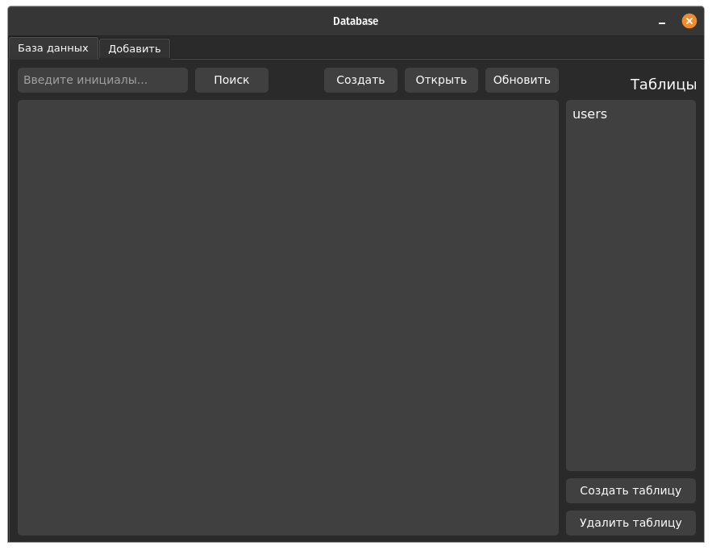
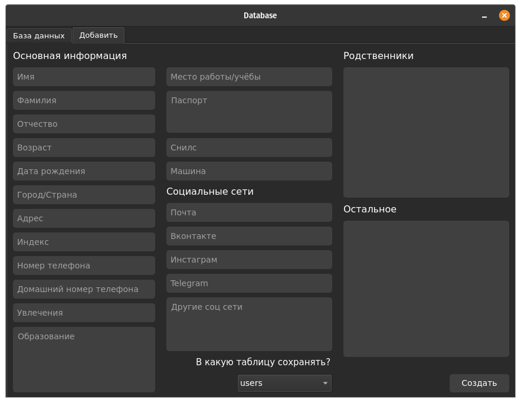
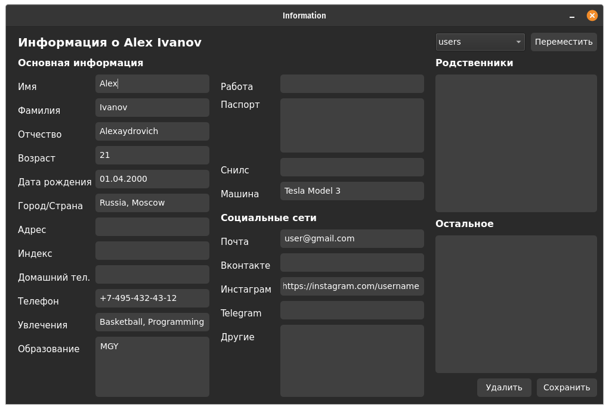

# Database
A program for creating a database and organizing information about people
____



### Install everything you need and run
#### Installation
```
pip3 install -r requirements.txt
```
#### Run
```
python3 ./main.py
```

### Additionally
In the `mysql_database` folder there is exactly the same program, but it creates a database not on SQLite but on a MySQL server
